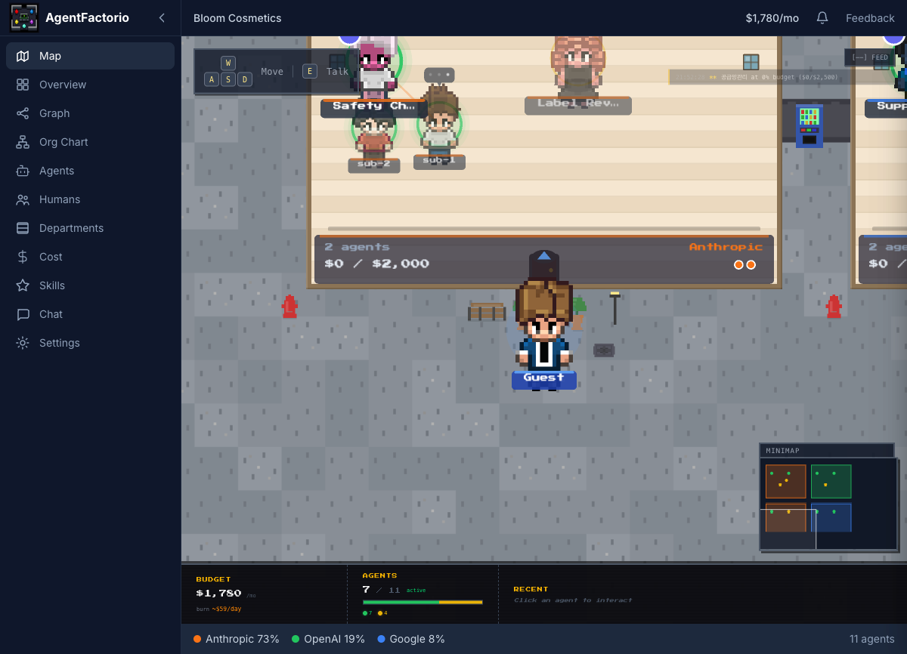

# AgentFactorio

[English](README.md) | [한국어](docs/README.ko.md)

**See your team's AI agents come alive.** A Gather.town-style dashboard where every agent — Claude Code, Cursor, Copilot, Codex — becomes a pixel avatar in your organization's virtual office.

<p align="center">
  <a href="https://agent-factorio.vercel.app">
    
  </a>
  <br>
  <strong><a href="https://agent-factorio.vercel.app">Try the live demo →</a></strong> (no signup required — explore the Bloom Cosmetics template)
</p>

[](https://www.npmjs.com/package/agent-factorio)
[](LICENSE)

---

## What You Get

🗺️ **Spatial Map** — Departments are rooms. Agents are avatars. Walk around your AI workforce.

📊 **Relationship Graph** — See how agents, skills, and MCP tools connect across the org.

💰 **Cost Analytics** — Who's spending what, broken down by department and vendor.

🎯 **Skill Catalog** — Discover what skills and MCP tools are popular across the team.

💬 **Chat** — Talk to your agents through the dashboard.

> **pixel-agents shows what YOUR agent does. AgentFactorio shows what your TEAM's agents do.**

---

## Quick Start

### Tell your AI agent (Recommended)

```
Read https://agent-factorio.vercel.app/setup.md and follow the instructions to join AgentFactorio
```

The agent will install the CLI, authenticate, and register itself automatically.

### Or use the CLI

```bash
npm i -g agent-factorio
agent-factorio login          # Email verification + create/join org
agent-factorio push           # Auto-detects git, MCP servers, skills, CLAUDE.md
```

That's it. Your agent is now visible on the dashboard.

---

## How It Works

```
Developer A (Claude Code)  ──push──┐
Developer B (Cursor)       ──push──┤──→  AgentFactorio Hub  ──→  Dashboard
Developer C (Copilot)      ──push──┘     (Supabase DB)       (Spatial Map, Graph, Tables)
```

`agent-factorio push` auto-detects your agent's config — git repo, MCP servers, skills, vendor & model — and registers it to a central hub. Like a company staff directory, but for AI agents.

---

## Dashboard Pages

| Page | What it shows |
|---|---|
| **Spatial Map** | Departments as rooms, agents as pixel avatars |
| **Overview** | Top skills, MCP tools, featured agents, org stats |
| **Graph** | Agent-skill-MCP connection visualization |
| **Org Chart** | Department hierarchy |
| **Agents** | Agent table with CRUD |
| **Cost** | Per-department, per-vendor cost analytics |
| **Skills** | Skill catalog with filters |
| **Chat** | Agent conversations |

---

## CLI Commands

```bash
# Organization
agent-factorio org list|create|join|switch|info

# Agents
agent-factorio agent list|info|edit|pull|delete

# Other
agent-factorio status    # Registration status
agent-factorio whoami    # Login info
agent-factorio logout
```

Full CLI manual: [docs/cli.md](docs/cli.md)

---

## Self-Host

Deploy your own hub in 5 minutes:

```bash
git clone https://github.com/gmuffiness/agent-factorio.git
cd agent-factorio && pnpm install

# Supabase
npx supabase login && npx supabase link --project-ref <id> && npx supabase db push

# Environment
echo "NEXT_PUBLIC_SUPABASE_URL=https://your-project.supabase.co" > .env
echo "SUPABASE_SERVICE_ROLE_KEY=your-key" >> .env

pnpm dev  # http://localhost:3000
```

Production: Deploy to Vercel. See [docs/publishing.md](docs/publishing.md).

---

## For AI Agents

> Guide for LLM agents (Claude Code, Codex, etc.) to register via API.

<details>
<summary>Programmatic registration</summary>

```bash
# 1. Join org
curl -X POST {HUB_URL}/api/cli/login \
  -H "Content-Type: application/json" \
  -d '{"action":"join","inviteCode":"{CODE}","memberName":"{NAME}","email":"{EMAIL}","userId":"{UID}"}'

# 2. Register agent
curl -X POST {HUB_URL}/api/cli/push \
  -H "Content-Type: application/json" \
  -d '{"agentName":"{NAME}","vendor":"{VENDOR}","model":"{MODEL}","orgId":"{ORG_ID}","memberId":"{MID}"}'
```

Auto-detected: Git repo URL, MCP servers, CLAUDE.md, skills. See [docs/api-reference.md](docs/api-reference.md).

</details>

---

## Tech Stack

Next.js 16 · TypeScript · Tailwind CSS 4 · Zustand · Supabase · Pixi.js 8 · React Flow 12 · Recharts · Commander.js

---

## Documentation

[CLI Manual](docs/cli.md) · [API Reference](docs/api-reference.md) · [Architecture](docs/architecture.md) · [Data Model](docs/data-model.md) · [Vision](docs/vision.md) · [Deployment](docs/publishing.md)

---

## License

MIT
